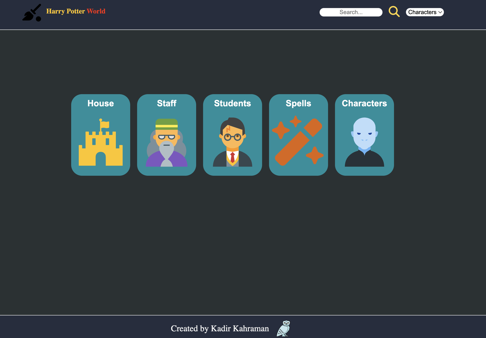

# 🪄 Harry Potter World

Eine interaktive Harry-Potter-Webanwendung auf Basis von **HTML5, CSS3 und Vanilla JavaScript**.

Mit dieser Anwendung können verschiedene Bereiche der Harry-Potter-Welt erkundet werden. Dazu gehören **Characters, Students, Staff, Spells und die vier Hogwarts-Häuser**.

Die Daten werden dynamisch über eine externe API geladen und anschließend über JavaScript in der Benutzeroberfläche dargestellt.

Das Projekt wurde als praktisches Frontend-Projekt entwickelt, um meine Kenntnisse in **API-Anbindung, asynchronem JavaScript, DOM-Manipulation, dynamischem Rendering, LocalStorage, Responsive Design und strukturierter Codeorganisation** weiterzuentwickeln.

---

## 🖥️ Preview

### Desktop Version



Die Desktop-Version bietet eine übersichtliche Darstellung der verschiedenen Kategorien sowie eine Such- und Filtermöglichkeit.

---

## ✨ Features

- 🧙 Characters
- 🎓 Students
- 🧑‍🏫 Staff
- ✨ Spells
- 🏰 Hogwarts Houses
- 🦁 Gryffindor
- 🐍 Slytherin
- 🦅 Ravenclaw
- 🦡 Hufflepuff
- 🔎 Suchfunktion
- 🔽 Kategorie-Filter
- 🌐 Externe API-Anbindung
- ⏳ Loading Screen
- ⚠️ Fehlerbehandlung bei API-Anfragen
- ❤️ Favoriten-Funktion
- 💾 Speicherung über LocalStorage
- 📱 Responsive Design
- 🎨 Thematisches Design
- 🧩 Dynamisches Rendering
- 📂 Strukturierte JavaScript-Dateien

> [!NOTE]
> Die Inhalte der Kategorien werden dynamisch über die verwendete Harry-Potter-API geladen.

---

## 🛠️ Technologien

### Frontend

- HTML5
- CSS3
- JavaScript
- Vanilla JavaScript
- CSS Custom Properties
- Flexbox
- Responsive Design

### JavaScript

- DOM Manipulation
- Template Literals
- Arrays
- Objects
- Functions
- Event Handling
- `fetch()`
- `async / await`
- `try / catch / finally`
- LocalStorage
- Dynamisches Rendering

### API

Die Anwendung verwendet die **HP API** für die Daten der Charaktere, Schüler, Mitarbeiter, Zaubersprüche und Hogwarts-Häuser.

---

## 🌐 API

Für die Anwendung werden folgende API-Endpunkte verwendet:

### Characters

```text
https://hp-api.onrender.com/api/characters